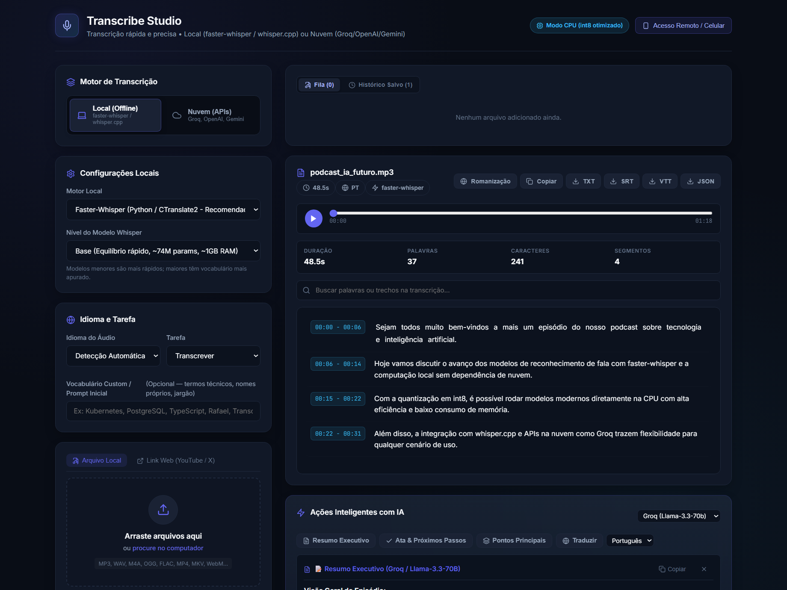

<div align="center">

# 🎙️ Transcribe Studio

**Aplicação moderna de transcrição de áudios e vídeos, pronta para auto-hospedagem e instâncias públicas abertas ao mundo (estilo Cobalt e Monochrome).**  
*Execute 100% offline no seu computador (faster-whisper / whisper.cpp), compartilhe remotamente com seu smartphone via QR Code (Túnel Cloudflare HTTPS grátis) ou acelere na nuvem (Groq, OpenAI, Gemini).*

[](https://github.com/realkalashnikov/transcriber/actions)


<br>



</div>

---

## ✨ Recursos Principais

### 🌐 Auto-Hospedagem & Instâncias Públicas (Estilo Cobalt)
- **Modos Flexíveis de Instância (`INSTANCE_MODE`)**:
  - `private`: Uso pessoal ou equipe fechada (exige PIN se configurado, salva histórico permanente no disco).
  - `public`: Aberto ao mundo como serviço público gratuito. **Sessões 100% isoladas** e modo efêmero — nenhum visitante enxerga os áudios de outro.
  - `byok` (*Bring Your Own Key*): Modo público onde cada visitante usa sua própria chave de API (Groq/OpenAI/Gemini).
- **Escudo Anti-Abuso & Quotas de Proteção**:
  - **Rate Limiting em Memória**: Bloqueia flood de requisições por IP e sessão (HTTP 429).
  - **Validação Estrita de Upload**: Limite de tamanho (`MAX_UPLOAD_SIZE_MB`) e duração de áudio (`MAX_AUDIO_DURATION_SECONDS`).
  - **Controle de Concorrência**: Limita transcrições simultâneas (`MAX_CONCURRENT_JOBS`) para não sobrecarregar sua GPU/CPU.
- **Auto-Cleaner Efêmero em Background**:
  - Limpa uploads órfãos e expira históricos e áudios antigos em modo público (padrão 60 minutos), mantendo o disco do host sempre limpo.

### 📱 Acesso Remoto pelo Celular & Túnel Cloudflare Integrado
- **Zero Configuração de Portas**: Baixa automaticamente o binário do Cloudflare Tunnel se necessário e cria uma URL temporária com HTTPS válido (`https://*.trycloudflare.com`).
- **Login em 1 Toque via QR Code**: O QR Code gerado no terminal e na interface já contém a URL com token seguro, conectando seu celular imediatamente ao escanear a câmera.
- **Detecção de Rede Wi-Fi (LAN)**: Descobre seu IP local automaticamente para uso em rede doméstica com latência zero.
- **Gravação Direta pelo Microfone do Smartphone**: O HTTPS provido pelo túnel permite gravação de voz diretamente no navegador do celular (Chrome/Safari).

### 🤖 API REST Pública v1 (`/api/v1`)
- Endpoints padronizados para bots de Discord, Telegram, automações e desenvolvedores:
  - `POST /api/v1/transcribe`: Transcrição de arquivos com retornos em JSON, TXT, SRT ou VTT.
  - `GET /api/v1/info`: Metadados da instância (status, limites, motores, hardware).
  - `GET /api/v1/status`: Verificação rápida de integridade (*health check*).
  - Documentação Swagger interativa em `/docs`.

### ⚡ Motores de Transcrição Locais & Nuvem
- **Local (Offline)**: `faster-whisper` (CTranslate2 com quantização int8 para CPU ou CUDA para GPU) e `whisper.cpp` (GGML).
- **Decodificação Nativa via PyAV**: Suporta MP3, WAV, M4A, OGG, FLAC, MP4, MKV, WebM, etc. sem depender do `ffmpeg.exe` externo.
- **Nuvem Opcional**: Groq (Whisper-large-v3 ultra-rápido), OpenAI (Whisper-1) e Gemini 2.5 Flash.

---

## 🚀 Como Iniciar

### No Windows (Menu Interativo)
Dê dois cliques no arquivo:
```cmd
run.bat
```
Você verá um menu simples:
```text
  [1] Local Pessoal (Apenas neste computador - Padrão)
  [2] Compartilhado / Celular (Túnel Cloudflare HTTPS com PIN)
  [3] Instância Pública Aberta (Estilo Cobalt, histórico efêmero)
  [4] Sair
```

### Pela Linha de Comando (CLI)
```bash
# 1. Modo Local Padrão (Apenas no PC)
python run.py

# 2. Modo Servidor / VPS / Amigos (Aberto na rede 0.0.0.0, com histórico isolado por pessoa)
# Basta apontar seu domínio (ex: transcreve.seusite.com) para o IP da sua VPS!
python run.py --public

# 3. Modo com Túnel Cloudflare (Opcional - para quem está em casa sem IP público / Celular)
python run.py --tunnel

# 4. Modo Protegido com PIN personalizado
python run.py --pin 123456
```

---

## 🌐 Como Hospedar na Internet

Você tem duas formas muito simples de disponibilizar o Transcribe Studio para outras pessoas:

### Opção A: Em uma VPS ou Servidor com IP Público (Recomendado)
Se você tem uma VPS (Hetzner, DigitalOcean, Oracle Cloud, etc.):
1. Execute `python run.py --public` (o servidor escuta em `0.0.0.0:8000`).
2. No seu painel de DNS, crie um apontamento tipo **A** apontando seu domínio/subdomínio para o IP da sua VPS.
3. *(Opcional)* Coloque um reverse proxy como Caddy ou Nginx na frente para HTTPS automático:
   ```caddy
   transcribe.seusite.com {
       reverse_proxy localhost:8000
   }
   ```
4. **Pronto!** Amigos e visitantes podem acessar livremente. Cada visitante tem seu histórico isolado de forma silenciosa e permanente no próprio navegador — sem necessidade de login ou senhas.

### Opção B: Direto do seu Computador de Casa (Sem abrir portas)
Se você quer rodar no seu PC gamer/desktop e liberar para amigos ou acessar pelo celular na rua:
1. Execute `python run.py --tunnel`.
2. O sistema iniciará automaticamente um túnel seguro Cloudflare HTTPS (`*.trycloudflare.com`) e exibirá um QR Code para você escanear.
3. Não precisa mexer no roteador nem ter IP fixo!

---

## 🛠️ Variáveis de Ambiente (`.env`)

Copie o arquivo de exemplo para configurar sua instância:
```bash
cp .env.example .env
```

| Variável | Padrão | Descrição |
|---|---|---|
| `INSTANCE_MODE` | `private` | Modo da instância: `private`, `public` ou `byok` |
| `INSTANCE_NAME` | `Transcribe Studio` | Nome visível da instância no cabeçalho e na API |
| `ACCESS_PIN` | *(vazio)* | PIN de segurança de 6 dígitos para acesso ao modo privado |
| `MAX_AUDIO_DURATION_SECONDS` | `300` | Duração máxima por áudio em segundos (5 min em público) |
| `MAX_UPLOAD_SIZE_MB` | `50` | Tamanho máximo por arquivo de upload em MB |
| `MAX_CONCURRENT_JOBS` | `2` | Número máximo de tarefas de inferência simultâneas |
| `RATE_LIMIT_PER_MINUTE` | `30` | Requisições permitidas por minuto por IP |
| `TRANSCRIBE_RATE_LIMIT_PER_MINUTE` | `5` | Transcrições permitidas por minuto por IP |
| `CLEANUP_EXPIRE_MINUTES` | `60` | Tempo para auto-excluir arquivos temporários no modo público |
| `PORT` | `8000` | Porta local do servidor HTTP |

---

## 🌐 Documentação da API REST v1

### 1. Metadados da Instância
```bash
curl -X GET "http://localhost:8000/api/v1/info"
```

### 2. Transcrever Arquivo de Áudio
```bash
curl -X POST "http://localhost:8000/api/v1/transcribe" \
     -F "file=@audio_exemplo.mp3" \
     -F "provider=faster-whisper" \
     -F "model=base" \
     -F "language=pt" \
     -F "response_format=json"
```

**Exemplo de Resposta JSON:**
```json
{
  "id": "e6f8b91a-7b3c-4d2a-89a1-0f7451234567",
  "text": "Olá mundo, esta é uma transcrição automática.",
  "language": "pt",
  "duration": 3.42,
  "model": "base",
  "provider": "faster-whisper",
  "segments": [
    {
      "id": 1,
      "start": 0.0,
      "end": 3.42,
      "text": "Olá mundo, esta é uma transcrição automática."
    }
  ]
}
```

### 3. Baixar Diretamente como Legenda SRT
```bash
curl -X POST "http://localhost:8000/api/v1/transcribe" \
     -F "file=@podcast.m4a" \
     -F "response_format=srt" > legendas.srt
```

---

## 🐳 Execução via Docker & Docker Compose

Para rodar em servidores ou VPS:

```bash
# Iniciar serviço em segundo plano
docker compose up -d --build
```

Para habilitar suporte a GPU NVIDIA no Docker, descomente a seção `deploy` no arquivo `docker-compose.yml`:
```yaml
deploy:
  resources:
    reservations:
      devices:
        - driver: nvidia
          count: all
          capabilities: [gpu]
```

---

## 📊 Guia de Modelos Whisper

| Modelo | Parâmetros | RAM Recomendada | Velocidade Relativa | Uso Recomendado |
|---|---|---|---|---|
| **tiny** | ~39M | ~1 GB | ⚡⚡⚡⚡⚡ (~32x) | Testes rápidos, rascunhos, servidores modestos |
| **base** | ~74M | ~1 GB | ⚡⚡⚡⚡ (~16x) | **Recomendado para uso diário em CPU** |
| **small** | ~244M | ~2 GB | ⚡⚡⚡ (~6x) | Boa precisão para vocabulários técnicos |
| **medium** | ~769M | ~5 GB | ⚡⚡ (~2x) | Alta precisão para áudios com ruído |
| **large-v3** | ~1550M | ~10 GB | ⚡ (1x) | Precisão máxima para dublagem/legendagem profissional |

---

## 📄 Licença

Distribuído sob a licença **MIT**. Veja o arquivo [LICENSE](LICENSE) para mais detalhes.
